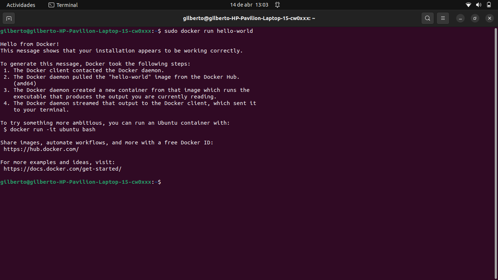

# Docker Engine

#### Prerrequisitos: Tener actualizados los paquetes de ubuntu.
    sudo apt-get update
    sudo apt-get upgrade

## Instalación a travez de Apt Repository

#### 1. Actualice el índice de paquetes apt e instale paquetes para permitir que apt use un repositorio a través de HTTPS.

    sudo apt-get install \
        ca-certificates \
        curl \
        gnupg \
        lsb-release

#### 2. Agregue la clave GPG oficial de Docker.

    sudo mkdir -m 0755 -p /etc/apt/keyrings
    curl -fsSL https://download.docker.com/linux/ubuntu/gpg | sudo gpg --dearmor -o /etc/apt/keyrings/docker.gpg

#### 3. Use el siguiente comando para configurar el repositorio.

    echo \
    "deb [arch=$(dpkg --print-architecture) signed-by=/etc/apt/keyrings/docker.gpg] https://download.docker.com/linux/ubuntu \
    $(lsb_release -cs) stable" | sudo tee /etc/apt/sources.list.d/docker.list > /dev/null

#### 4. Actualice el índice del paquete apt.
    
    sudo apt-get update

#### 5. Actualize los permisos de docker y nuevamente actualize el indice del paquete apt.

    sudo chmod a+r /etc/apt/keyrings/docker.gpg
    sudo apt-get update

#### 6. Para instalar la última versión, ejecute.
    sudo apt-get install docker-ce docker-ce-cli containerd.io docker-buildx-plugin docker-compose-plugin

#### 7. Verifique que la instalación de Docker Engine sea exitosa ejecutando la imagen hello-world:
    sudo docker run hello-world

## Documentación utilizada.

#### https://docs.docker.com/engine/install/ubuntu/#set-up-the-repository       
  
# Comandos Basicos de Docker Engine
- docker run: Ejecuta un contenedor de Docker a partir de una imagen.
- docker ps: Muestra una lista de los contenedores de Docker en ejecución en el sistema.
- docker images: Muestra una lista de las imágenes de Docker que están almacenadas en el sistema.
- docker build: Crea una nueva imagen de Docker a partir de un archivo Dockerfile.
- docker stop: Detiene un contenedor de Docker en ejecución.
- docker rm: Elimina un contenedor de Docker existente.
- docker rmi: Elimina una imagen de Docker existente.
- docker pull: Descarga una imagen de Docker desde un repositorio de imágenes de Docker.
- docker push: Sube una imagen de Docker al registro de imágenes de Docker.
- docker exec: Ejecuta un comando dentro de un contenedor de Docker en ejecución.

### Comandos adicionales
- sudo docker ps -a
