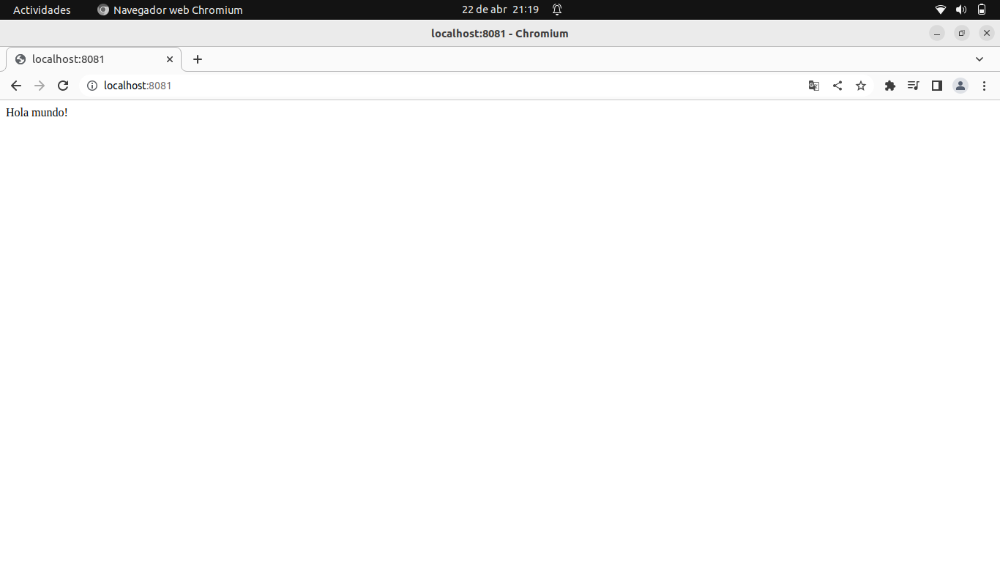

# Crear mi primer HTML en docker

### 1. Creamos nuestro contenedor y lo ponemos en marcha.
    sudo docker run --name website -v ${pwd}:/usr/share/nginx/html -d -p 8081:80 nginx
#### Nota: En mi caso utilize el puerto 8081, sin embargo puedes utilizar el que tu quieras.

### 2. Accedemos al contenedor.
    sudo docker exec -it website bash

### 3. Ya ahí dentro, creamos nuestro archivo HTML.
    echo "Hola mundo!" > /usr/share/nginx/html/index.html

### 4. Salimos del contenedor.
    exit

### Verificamos los cambios accediendo a la siguiente direccion web:
    http://localhost:8081

